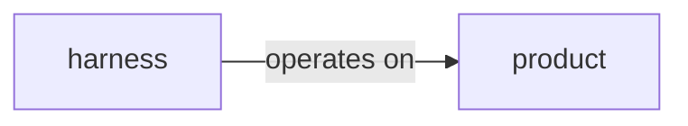

# brianbest.com

Personal site and blog for Brian Best, Principal Software Developer. A statically-generated
Next.js app with a markdown-backed blog and an AI "Chat with Brian's AI" feature
(general Q&A + job-description fit assessment).

The site uses the **Terminal Notebook** design language — a dark, mono-forward,
red-on-black IDE/terminal aesthetic — across every page. The blog is written primarily as a
knowledge base for LLMs (and future-me), so posts expose "copy as markdown" / "send to chat"
affordances and machine-friendly structure, and the whole site is available as one plain-text
document at `/llms-full.txt`.

## Tech stack

- **Next.js 15** (App Router) + **React 19** + **TypeScript**
- **Tailwind CSS 3** (+ `@tailwindcss/typography`) for styling
- **next-mdx-remote** for rendering markdown blog posts
- **mermaid** for diagrams in posts
- **AI SDK** (`ai` / `@ai-sdk/*`) on top of the OpenAI API for the chat + job-fit endpoints
- **Vitest** (unit) + **Playwright** (e2e) for tests
- Deployed on **Vercel**

## Getting started

### Prerequisites

- Node.js 20+ (Next.js 15 requires ≥ 18.18)

### Install & run

```bash
npm install
npm run dev      # http://localhost:3000
```

Common scripts:

| Script | What it does |
|--------|--------------|
| `npm run dev` | Dev server with hot reload |
| `npm run build` | Production build (static export of pages) |
| `npm start` | Serve the production build |
| `npm run lint` | ESLint (flat config in `eslint.config.mjs`) |
| `npm run test:run` | Vitest unit tests once |
| `npm run test:e2e` | Playwright end-to-end tests |

---

## Design system — "Terminal Notebook"

Dark only. Bold red accent on near-black. Geist for display/body, JetBrains Mono for all the
terminal chrome (prompts, labels, code, metadata). There is **no light mode** and no theme toggle.

### Color tokens

Defined in `tailwind.config.ts` under `theme.extend.colors.term`. Use them as
`bg-term-*` / `text-term-*` / `border-term-*`. **Never hardcode hex values in components** —
the only exceptions are the mermaid theme config and the OG image template, where the
library/runtime can't read Tailwind tokens (values mirror the tokens and are commented).

| Token | Hex | Use |
|-------|-----|-----|
| `term-bg` | `#0f0d0c` | page background |
| `term-bg-2` | `#161311` | panels, nav, footer, cards |
| `term-bg-3` | `#1c1916` | code header/footer bars, active rows |
| `term-bg-4` | `#23201c` | deepest surface |
| `term-fg` | `#ece6dd` | primary text |
| `term-fg-soft` | `#b8b0a6` | secondary text |
| `term-fg-muted` | `#7a7166` | labels, muted meta |
| `term-rule` | `#2a2622` | borders |
| `term-rule-soft` | `#211e1a` | faint borders |
| `term-accent` | `#ef4444` | the red — cursor/prompt, links, CTAs |
| `term-accent-soft` | `rgba(239,68,68,0.14)` | callout/pill backgrounds |
| `term-accent-deep` | `#b91c1c` | hover/pressed accent |
| `term-green` / `term-yellow` / `term-blue` | `#7dd3a8` / `#e6c98a` / `#8ab4e6` | status dots, syntax, fit/flag markers |

### Fonts (`app/layout.tsx`)

| Tailwind class | Font | CSS var | Used for |
|----------------|------|---------|----------|
| `font-sans` | **Geist** (`geist` package) | `--font-geist-sans` | headings, body |
| `font-mono` | **JetBrains Mono** (`next/font/google`) | `--font-mono` | prompts, labels, code, metadata |

Reference fonts via the Tailwind classes (`font-sans`, `font-mono`), not the raw CSS vars.
TTF copies of Geist (Sans Bold + Mono Regular) live in `assets/fonts/` for the OG image
renderer — satori can't read woff2.

### Shared components — `components/terminal/`

| Component | Props | Notes |
|-----------|-------|-------|
| `TerminalNav` (`nav.tsx`) | `active?`, `postCount?` | Global nav. Auto-highlights the active tab from the route (`usePathname`). Mobile collapses to a monogram + chat pill + hamburger. Rendered once by `components/layout.tsx`, which passes the real post count. |
| `TerminalFooter` (`footer.tsx`) | — | Terminal `$ echo` footer + links (github, linkedin, contact, rss, llms-full.txt). |
| `Prompt` (`prompt.tsx`) | `kind?: "$"\|"#"\|">"` | Inline shell-prompt line; sigil is colored by kind. |
| `CodeBlock` (`code-block.tsx`) | `code`, `title?`, `lang?`, `showLineNumbers?`, `footerMeta?`, `dotColor?` | Framed code block: header dot+title, copy/raw actions, optional line-number gutter, footer meta. Client component. |
| `Mermaid` (`mermaid.tsx`) | `chart` | Real Mermaid, lazy-loaded client-side, dark-themed; falls back to `<pre>` on error. |
| `MermaidDiagram` (`mermaid-diagram.tsx`) | — | Static hand-drawn SVG (the "harness beside product" figure). |
| `TagPill` (`tag-pill.tsx`) | `tag`, `active?`, `href?` | `#tag` / `*` chip. |
| `Callout` (`callout.tsx`) | `label?` (default `"NOTE TO FUTURE SELF"`) | Accent-left note box. Markdown blockquotes render as this. |
| `CoverPlaceholder` (`cover-placeholder.tsx`) | `label`, `height?` | Striped placeholder for cover-image slots. |
| `TerminalProjectCard` (`project-card.tsx`) | `project`, `index` | Project grid card (header bar, cover placeholder, tags, `featured` chip). |
| `ContactChannels` (`contact-channels.tsx`) | — | Contact page channel rows + LinkedIn CTA; fires `contact_click` analytics. |
| `CopyMarkdownButton` / `SendToChatButton` (`copy-actions.tsx`) | see file | "copy as markdown" (clipboard) and "send to chat" (→ `/chat`) affordances. |

Syntax highlighting lives in `lib/highlight.tsx` (`highlight(src, theme)` → React nodes), used by
`CodeBlock` and the markdown renderer.

### Data layer

- **`lib/posts.ts`** — reads `content/blog/*.md` via `gray-matter`.
  - `getPosts()` → `PostMeta[]` (newest-first), `getPost(slug)` → `Post` (incl. raw `content`).
  - `getAdjacentPosts(slug)` → `{ prev, next }` (prev = newer, next = older).
  - `extractHeadings(content)` → `{ id, text, level }[]` for the post outline (ids via `slugify`).
  - `PostMeta` includes computed `readingTime` and `wordCount`.
- **`lib/projects.ts`** — reads `content/projects/*.md` via `gray-matter` (same model as the blog).
  - `getProjects()` → `Project[]` (featured first, then title A–Z), `getProject(id)` → `Project | null`.
  - Frontmatter: `title`, `description`, `tags`, `url`, `featured`, `image`; the filename is the `id`.
    Body markdown is kept on `content` for a future project detail page. Blank `url` renders a
    "local / private" card; blank `image` falls back to the striped `CoverPlaceholder`.
- **`lib/career-profile.ts`** — typed career data (experiences, skills matrix, STAR narratives,
  education, awards). Powers `/about`, the home roles panel, the AI system prompt
  (`getPublicProfileAsText()`), and `/llms-full.txt`.
- **`lib/utils.ts`** — `cn`, `formatDate`, `formatTerminalDate` (lowercase, **UTC** so date-only
  frontmatter never shifts a day), `slugify` (shared by `extractHeadings` and the heading renderer
  so outline anchors line up).
- **`lib/og-template.tsx`** — `renderOgImage({ title, subtitle, path, meta })` → satori
  `ImageResponse` used by every `opengraph-image.tsx`.

---

## Pages

| Route | File(s) | Design |
|-------|---------|--------|
| `/` Home | `app/page.tsx` | Bash-session hero, `./status` block, CV-style "Previous roles" (from `lib/career-profile.ts`), "Chat with Brian's AI" CTA. |
| `/blog` Blog index | `app/blog/page.tsx`, `components/blog-index.tsx`, `components/post-card.tsx` | Terminal header, interactive tag-pill filter, file-explorer card grid. |
| `/blog/[slug]` Post | `app/blog/[slug]/page.tsx`, `components/mdx-content.tsx`, `components/post-toc.tsx` | 3-column editor: outline / article / "for your LLM" + metadata rail. |
| `/projects` Work | `app/projects/page.tsx`, `components/terminal/project-card.tsx` | `~/work/` header + 1px-gap card grid from `content/projects/*.md`. |
| `/about` About | `app/about/page.tsx` | `whoami`, photo + bio, `git log ./career` timeline, skills (with honest gaps), background, education/awards. |
| `/contact` Contact | `app/contact/page.tsx`, `components/terminal/contact-channels.tsx` | Channel rows (linkedin/github/youtube) + LinkedIn CTA + AI hand-off card. No email on the page by design. |
| `/chat` Chat | `app/chat/page.tsx`, `components/chat/*` | Unified "Chat with Brian's AI" (see below). |
| `/job-fit` | — | **Retired.** 308-redirects to `/chat` (`next.config.mjs`). The `/api/job-fit` endpoint remains (used by `/chat`). |

`components/layout.tsx` wraps every page with `TerminalNav` + `TerminalFooter`, so pages render
**only their own content** (don't add a nav/footer per page).

### SEO & machine-readable routes

- `app/sitemap.ts` → `/sitemap.xml` (static routes + posts), `app/robots.ts` → `/robots.txt`.
- Every route has a generated Open Graph image (`opengraph-image.tsx` per segment, rendered from
  `lib/og-template.tsx`); blog posts get per-post images with date/reading-time/tags.
- `app/rss.xml/route.ts` → RSS 2.0 feed of the blog.
- `app/llms-full.txt/route.ts` → entire site (public career profile + all posts) as plain text.
- `app/api/posts/[slug]/raw/route.ts` → raw markdown of a post (linked from the post rail).
- Canonical domain is **https://brianbest.com** (`metadataBase` in `app/layout.tsx`).

---

## Adding a blog post

Create `content/blog/<slug>.md`. The filename (minus `.md`) is the URL slug; no code changes are
needed — `getPosts()`/`getPost()` read the directory at build time.

Frontmatter (parsed by `gray-matter`):

````markdown
---
title: "Your Post Title"
date: "2026-05-20"          # YYYY-MM-DD (formatted in UTC)
summary: "One- or two-sentence dek shown on cards and as the post lead."
tags: ["agents", "workflow"] # first tag is the card's primary tag
---

## A section heading

Body in Markdown. `##` / `###` headings get accent prefixes, anchor ids, and feed the
"On this page" outline automatically.

```python
# Fenced code gets the terminal CodeBlock: line numbers + green dot for runnable
# languages; shell/console blocks get no gutter and a red dot.
def hello() -> str:
    return "world"
```



> Blockquotes render as a "NOTE TO FUTURE SELF" callout.
````

`readingTime` and `wordCount` are computed automatically. Each post page exposes **copy as
markdown** and **send to chat**, and serves its raw source at `/api/posts/<slug>/raw`.

---

## AI: "Chat with Brian's AI" (`/chat`)

A single client experience (`components/chat/chat-experience.tsx`) with two modes:

- **Ask about Brian** — general chat via `useChat()` → `POST /api/chat` (streaming). System prompt
  in `lib/ai/system-prompt.ts`.
- **Vet a job description** — `POST /api/job-fit` with `{ jobDescription }` → `{ analysis }`. The
  analysis text (containing `STRONG FIT` / `MODERATE FIT` / `NOT A FIT`) is rendered as a
  fit-assessment card (`components/chat/fit-assessment.tsx`) with a derived score band, "where
  Brian aligns" / "worth flagging" sections, and a hand-off CTA.

Both API routes validate input, rate-limit per client, and (optionally) persist interactions —
see `lib/ai/*`. The chat header's `knowledge:` date tracks the newest post automatically.

Model IDs are configured in the route files (`app/api/chat/route.ts`, `app/api/job-fit/route.ts`).

---

## Testing

- **Vitest** — `lib/ai/validation.test.ts` (input validation + injection detection).
- **Playwright** (`e2e/`):
  - `smoke.spec.ts` — every route renders, terminal nav/footer present, **zero legacy
    Persona-era classes**, no console errors.
  - `seo.spec.ts` — `/job-fit` 308 redirect, og:image works, sitemap/robots/rss/llms-full.txt.
  - `chat.spec.ts` — chat + JD-mode interactions with `/api/chat` and `/api/job-fit` mocked
    via `page.route` (no live OpenAI calls).

---

## Environment variables

| Var | Required for | Notes |
|-----|--------------|-------|
| `OPENAI_API_KEY` | the AI chat + job-fit endpoints | without it, `/chat` UI renders but calls fail |
| `DATABASE_URL` | AI interaction analytics (optional) | Neon/Postgres connection string |

### AI interaction analytics (optional, Postgres)

The chat and job-fit endpoints can persist prompts/outputs for later dashboarding. Run the SQL in
`spec/ai-interactions-schema.sql` once; in production the table/indexes are also auto-created on
first write. Stored fields: request text, response text, endpoint (`chat` | `job_fit`), model,
timestamp, status.

---

## Project structure

```
app/                      # App Router pages + API routes
  page.tsx                #   home
  blog/                   #   blog index + [slug] post (+ per-post OG images)
  projects/ about/ contact/ chat/
  api/{chat,job-fit}/     #   AI endpoints
  api/posts/[slug]/raw/   #   raw post markdown
  rss.xml/ llms-full.txt/ #   feed + LLM full-text routes
  sitemap.ts robots.ts opengraph-image.tsx
  layout.tsx globals.css  #   fonts, metadata defaults, terminal base styles
assets/fonts/             # TTFs for the OG image renderer (satori)
components/
  terminal/               # shared Terminal Notebook design-system components
  chat/                   # /chat experience + fit-assessment card
  blog-index.tsx post-card.tsx post-toc.tsx mdx-content.tsx social-links.tsx
  layout.tsx              # nav + footer wrapper
content/blog/*.md         # the blog posts (source of truth)
content/projects/*.md     # the projects (source of truth)
lib/                      # posts, projects, utils, highlight, og-template, ai/*, career-profile
e2e/                      # Playwright specs (smoke, seo, chat)
```

---

## Things to know

- **Dark-only.** The design assumes the terminal theme; there is no light mode.
- **Use `term-*` tokens** for all colors and the shared terminal components for new UI.
- **postcss override.** `package.json` overrides Next's bundled `postcss` to `^8.5.10` to clear a
  stringify-XSS advisory (Next pins `8.4.31`). Keep this until Next ships a newer postcss.
- `next.config.mjs` sets `typescript.ignoreBuildErrors` — run `npx tsc --noEmit` to typecheck;
  `next build` alone won't catch type errors.

## Deployment

Deployed on Vercel: push to `main`, Vercel builds and deploys. Set `OPENAI_API_KEY` (and
`DATABASE_URL` if using analytics) in the Vercel project settings.

## License

MIT
