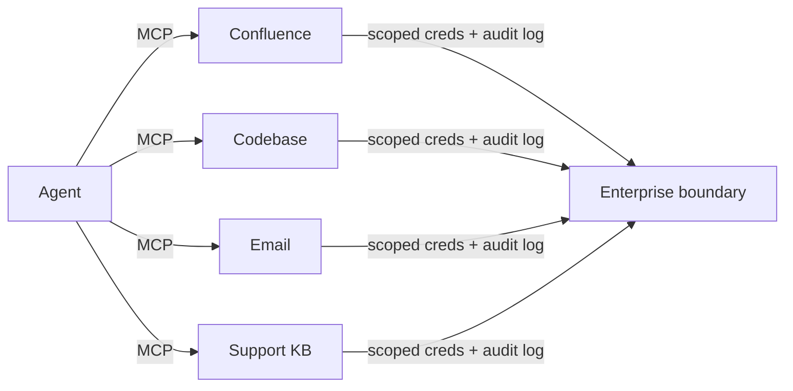

A year ago, every "agent" I built was a bespoke pile of tool definitions, retry loops, and JSON-schema babysitting. Each new integration meant teaching the model a new dialect, hand-rolling auth, and praying the function-calling format didn't drift between providers. It worked, but it didn't compose.

Then MCP quietly turned the problem inside out.

## The shift

The Model Context Protocol gives tools a standard shape — a server speaks MCP, a client speaks MCP, and the model on the other end doesn't care who wrote either side. That sounds boring. It is not boring. It is the difference between "I built an agent that can do X" and "I plugged my agent into the ecosystem of things that already do X."

### A concrete swap

Our Confluence integration started as ~300 lines of custom tool definitions, auth handling, and pagination logic wired directly into the agent. Every change to the Confluence API meant touching agent code. Swapping it for an off-the-shelf MCP server looked like this:

```jsonc
// Before: custom tool wired into the agent
// ~300 lines: schema, auth, retry, pagination — all in agent code

// After: MCP server as config
{
  "mcpServers": {
    "confluence": {
      "command": "npx",
      "args": ["-y", "@modelcontextprotocol/server-confluence"],
      "env": { "CONFLUENCE_TOKEN": "${CONFLUENCE_TOKEN}" }
    },
    "codebase": {
      "command": "node",
      "args": ["./mcp/codebase-server.js"],
      "env": { "GITHUB_TOKEN": "${GITHUB_TOKEN}" }
    }
  }
}
```

Same capability, but tool maintenance decoupled from agent logic. The junior who shipped the codebase MCP server didn't need to know anything about prompt engineering or context windows — they just built a server that speaks MCP.

That felt like the first time I used `npm install` instead of vendoring a library by hand.

## What changed for my team

- **Tool development decoupled from agent development.** A junior dev can ship an MCP server in an afternoon. They don't need to know anything about prompt engineering, model selection, or context windows.
- **Tools became testable in isolation.** MCP servers are just servers. You unit-test them like servers. You don't need an LLM in the loop to know the tool works.
- **Composition got cheap.** We routinely run agents with eight or ten MCP servers attached. What used to be a custom orchestration nightmare is now a config file.



## What I still don't love

**Discovery is still unsolved.** There's no good answer yet for "which of my 47 connected tools should the model reach for in this context?" What we do today is pragmatic but manual: per-task allowlists that filter tool exposure before the agent sees it.

```jsonc
// Our current band-aid — per-task tool scoping
{
  "task": "triage-support-ticket",
  "allowedTools": ["search_kb", "read_logs", "get_similar_tickets"],
  "blockedTools": ["send_email", "write_code", "deploy"]
}
```

It works, but it's a convention layered on top of the protocol, not part of it. Every team I talk to has invented some version of this.

**Permission scoping is also early.** The protocol punts most of the auth model to the implementer, which means every team reinvents approval flows — who can call what, when, with whose credentials, and with what audit trail. We built ours around credential isolation (agents never see raw tokens), per-tool approval gates, and structured audit logging where every tool call is attributable. It holds up, but I expect the protocol itself to converge on a shared model in the next year.

## The bet

If you're starting an agent project today and not building on MCP, you're choosing extra integration work for no durable benefit. The ecosystem is moving there — package your tools as MCP servers and your agents stay portable even as models change. That said, "won" overstates it: discovery and auth are still yours to solve. Build on it, but budget for those gaps.
