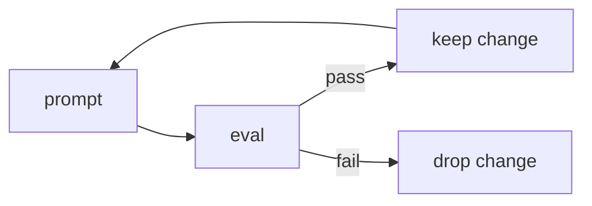

A personal toolkit of slash commands for agentic-coding sessions — three commands I actually run daily:

- **`/health` — silent health check.** Stays quiet unless something is wrong. Cheap enough to run on every session start without adding noise when things are green.

```text
$ /health
# all green — no output (exit 0)

$ /health            # when something is off:
! branch is 12 commits behind main
! 3 tests failing in lib/ai/validation.test.ts
! .env.local missing OPENAI_API_KEY
```

- **`/loop` — iterative prompt looping.** Re-runs a prompt until a condition is met, backed by state files and a bash stop hook. Useful for "keep polishing this until the eval passes."

```text
$ /loop "improve the error handling in lib/ai/validation.ts"
  → run 1: edits applied, eval 72% — continuing
  → run 2: edits applied, eval 84% — continuing
  → run 3: eval 91% — threshold met, stopping
```

- **`/improve-prompt` — eval-gated prompt improvement.** Improves a prompt only when the change clears an eval bar, following Karpathy's autoresearch methodology — no change ships unless the numbers move.



Each command is a standalone slash command with its own state and tests. Private repo for now — the health check and loop are the most reusable if I extract them.
