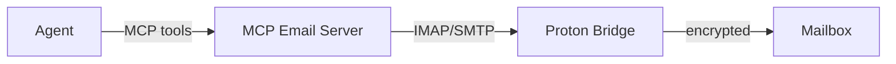

A Model Context Protocol (MCP) server that gives AI agents first-class email — reading and sending mail autonomously over IMAP/SMTP.

## Why this instead of an API wrapper

Most email integrations for agents are one-off function definitions. This one is an MCP server, so any MCP-compatible client can use it without custom wiring. The agent doesn't need to know it's email — it just sees tools like `search_mail`, `read_message`, and `send_message`.

## Stack & security

`imapflow` and `nodemailer` for the mail transport, `@modelcontextprotocol/sdk` to expose the tools, and **Proton Mail Bridge** as the transport layer — the agent talks to an end-to-end-encrypted mailbox over a local bridge rather than the open internet.

Credentials never leave the bridge. The agent sees scoped tools, not raw IMAP secrets.

## What it handles

- Search and read with filters (folder, date range, unread)
- Send with proper threading (`In-Reply-To`)
- Attachment awareness without dumping binary into context
- Scope control — the server only exposes the tools you configure

Private repo — the `Proton Bridge → imapflow` pairing is the part I'd extract if I open-sourced it.
