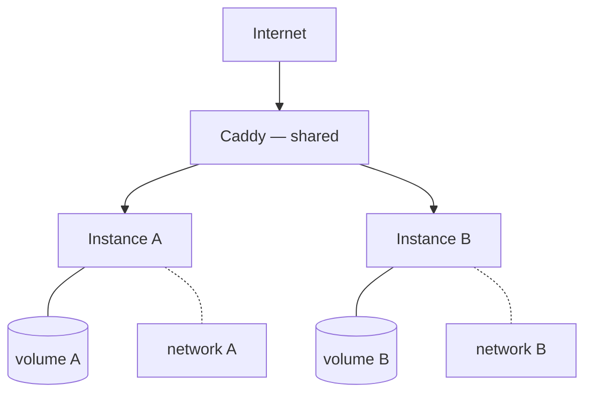

Two isolated instances of an open-source agentic AI system running on a single always-on home server. I use it as a personal sandbox for validating multi-tenant agent isolation — what it takes to run several autonomous agents on one box without letting them leak into each other's state.

## Architecture

Three Docker Compose stacks: one shared Caddy reverse proxy in front, and a fully isolated stack per instance.

Each instance gets its own credentials, volumes, and Docker network. Agents can't reach each other's state — intentionally. That isolation is the point: it mirrors the credential-scoping and audit-logging I care about in production AI.

## Why self-hosted

Cloud agents hide the isolation problem. On one box, you feel it — shared ports, overlapping volumes, credential leakage. Solving it with `Caddy + Compose + network isolation` is cheap and reproducible, and it stress-tests the same patterns (scoped access, attributable actions) that matter inside enterprise compliance boundaries.
